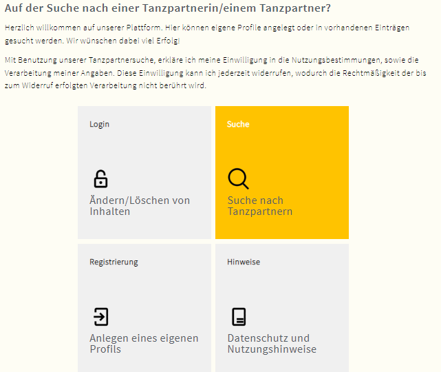
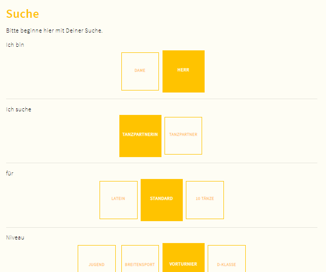
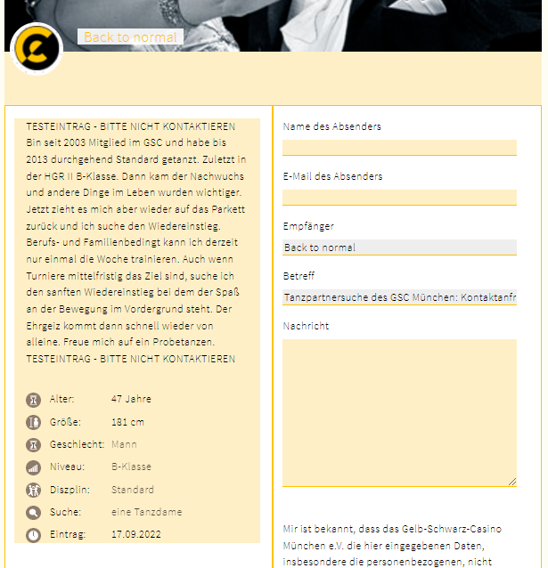

.. include:: ../Includes.txt

.. _introduction:

============
Introduction
============

.. _what-it-does:

What does it do?
================

The extension was written to allow members and friends of our dancing club to find a dancing partner.

Users can either search in published profiles and get in touch by sending an email. Or they can set up a 
profile on their own and get contacted via mail.

The beauty of the system is, that the intial contact mail is sent via the TYPO3 server to the profile owner.
Therefore the profile is anonymous (if a username/nickname was chosen and not the real name) until the very moment 
a reply to the contact e-mail is sent. The latter happens via normal e-mail servers and communication and outside 
of the TYPO3 instance. As the profile was verified with a verification mail and code, and a profile is valid for
a maximum of 6 months (default setting), fake profiles should be in theory reduced to a minimum.

Contacting a profile does not require a verification. If problems with spam comes up, a captcha can be installed.
At least the system is checking for a valid mail by verifying the syntax of the mandatory replyto mail.

The extension is designed to ask for the least possible set of data. So a nickname - not the real name - is used.
Personal data are the mail to send contact requests to, age in years and height in cm. Every profile user has a 
textfield to enter some information about themself. They are absolutely free to enter additional information or not.
All other information asked for is about preferences for a dancing partner. Predefined selections help to find
the right categories in no time.

On the other side the system provides filters to quickly find potentially matching profiles.

Please note, that every username and every e-mail address can only be registered once. If the profile gets deleted
or expires after 6 months (default setting), e-mail and username can be registered again.

You can also add terms and conditions for using the extensions functionality as well as data privacy policies.
The extension comes out of the box with a default description fitting to our needs.

.. _important:

Important
=========

   - Don't forget to include the static template brought by this extension to your TYPO3 configuration.

   - Check terms and conditions as well as the data privacy policies delivered with the extension and fit it to your needs

   - You might want to edit the CSS settings provided with the box to make them fit to your website.

.. _screenshots:

Screenshots
===========

Main Menu helps users to either set up/edit a profile or start a filtered search in the database of excisting
profiles. Terms and conditions and a privacy policy help users to understand how to use the service and what
happens to their data.

In the Search Menu filters can be set and a search can be started.

Users can easily set up a profile with their personalized information and publish it 
online after a verification of their e-mail address.

